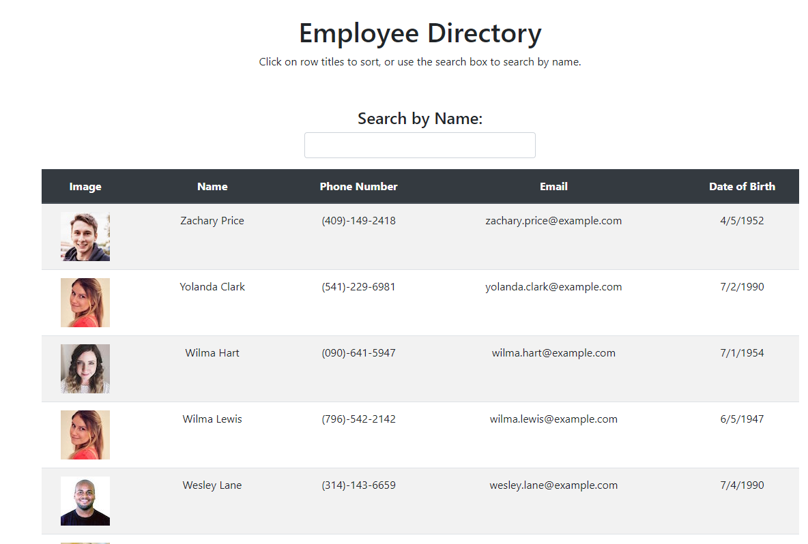

# Employee Directory
[](https://opensource.org/licenses/MIT)

## Table of Contents
* [Installation Instructions](#installation-instructions)
* [Questions](#questions)
* [License](#license)


A react application to sort and filter a list of 200 employees by name. After the page loads a user can search for employees by first or last name, and click on the header 'Name' to sort alphabetically or reverse alphabetically. Click [here](https://veryfaye.github.io/EmployeeDirectory) to view the deployed application.

List of Employees sorted reverse alphabetically.


Filtered Employees sorted alphabetically.


## Installation Instructions
Use the following commands to install this application.
```
npm i
```
Use the following commands to run this application.
```
npm start
```

## Questions
To get in contact with me please see my Github [here](https.github.com/undefined), or [email me](mailto:undefined)!

## License
Copyright 2021 Amanda LeMoine

Permission is hereby granted, free of charge, to any person obtaining a copy of this software and associated documentation files (the "Software"), to deal in the Software without restriction, including without limitation the rights to use, copy, modify, merge, publish, distribute, sublicense, and/or sell copies of the Software, and to permit persons to whom the Software is furnished to do so, subject to the following conditions:

The above copyright notice and this permission notice shall be included in all copies or substantial portions of the Software.

THE SOFTWARE IS PROVIDED "AS IS", WITHOUT WARRANTY OF ANY KIND, EXPRESS OR IMPLIED, INCLUDING BUT NOT LIMITED TO THE WARRANTIES OF MERCHANTABILITY, FITNESS FOR A PARTICULAR PURPOSE AND NONINFRINGEMENT. IN NO EVENT SHALL THE AUTHORS OR COPYRIGHT HOLDERS BE LIABLE FOR ANY CLAIM, DAMAGES OR OTHER LIABILITY, WHETHER IN AN ACTION OF CONTRACT, TORT OR OTHERWISE, ARISING FROM, OUT OF OR IN CONNECTION WITH THE SOFTWARE OR THE USE OR OTHER DEALINGS IN THE SOFTWARE.